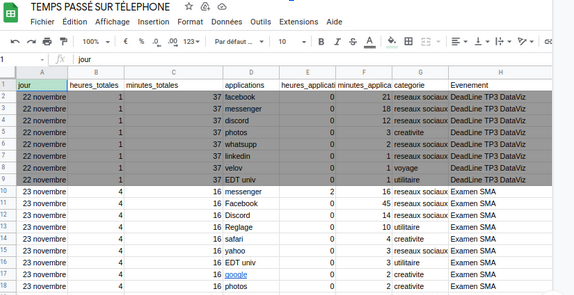

# README - Projet dans le cadre de l'UE Data Visualisation
### AJMI Doriane - FERRAND Gérome
### HENINI Léo - MAKHLOUF Mohamed-El-Mehdi

Le téléphone mobile n'est plus aujourd'hui qu'un simple outil pour appeler et répondre aux appels. Il est doté de tellement de fonctionnalités différentes qu'il est très difficile pour la plupart d'entre nous de s'en séparer. On peut même entendre qu'il représente une certaine prolongation de la main de l'homme tant  nous l'avons souvent dans la main. Que ce soit dans les transports, au travail, dans notre cuisine ou ailleurs, notre téléphone a toujours une bonne raison d'être présent et d'être sollicité voir indispensable.
>  En effet, les Français consacrent en moyenne deux heures par jour à leur smartphone, révèle une étude du cabinet américain App Annie. C'est bien moins que les jeunes, qui y consacrent près de 4 heures (source : BFMTV Pauline Dumonteil).

 En parcourant nos données qui résument l'utilisation de nos téléphones nous nous sommes rendu compte que nous l'utilisons différemment en fonction de ce qui se passe dans notre vie. Le type d'application utilisé sera différent en fonction du fait qu'on soit en vacances à l'étranger, en pleine période d'examen ou seul chez soi en jours de repos.
 Ce sont ces variations d'utilisation que nous avons cherché à observer au cours de ce projet.

 Dans un premier temps nous avons collecté les données de chacun des membres de l'équipe et nous les avons saisis dans un tableur. Il s'agit du temps total par jour de chacun passé sur nos téléphone ainsi que les applications utilisé associé au temps passé dessus. Nous avons associé chaque application a une certaine catégorie. Enfin, chaque jour nous avons mentionné s' il y avait un événement "spécial" et l'avons spécifié.
 
 **Notre page de visualisation est composé de trois éléments principaux :**

 
 
 **1 :** Une carte d'identité ou l'on va retrouver l'avatar de la personne dont on observe les données. Nous retrouvons aussi une liste d'événements qui correspond aux événements vécus par la personne sélectionnée sur la période étudiée. Chaque événement est décrit par une description et une date.
Nous avons aussi un radar chart (appelé aussi graphique araigné) qui est un graphique d'affichage de données multivariées sous la forme d'un diagramme bidimensionnel. Ce graph nous permet d'avoir un aperçu sur le pourcentage de temps passé par chacun sur les applications des différentes catégories.
| Point positif | Point négatif |
| ------ | ------ |
| Nous avons un aperçu rapide du temps passé par la personne sur les applications des différentes catégories. Une comparaison peut se faire rapidement. Par exemple, si le rendu final à un aspect "circulaire", nous pouvons en déduire que la personne utilise des applications dans toutes les catégories de manière à peu près similaire. Cependant, si on observe des pics, nous pouvons déduire qu'il s'agit d'une personne qui utilise plus une telle catégorie qu'une autre. De plus ce type de graphique à un aspect "joli" qui peut attirer le regard et donner envie de le comprendre. |Malheureusement, même avec une échelle commune entre les axes, la comparaison des valeurs entre eux reste fastidieuse et sujette à erreur lorsqu'on veut être précis. En effet, au lieu de la simple comparaison en ligne droite que notre perception visuelle est câblée pour effectuer et que l'on trouve dans les types de graphiques "conventionnels", la comparaison dans ce type de visualisation nécessite une réflexion consciente pour projeter mentalement une sorte d'arc de rotation afin de faire correspondre une valeur d'un axe à un autre.| 

**2 :** Un bar chart qui est un graphique composé par des barres qui va permettre la visualisation du temps total passé sur nos téléphones. Chaque barre représente une journée et elle est segmentée par des couleurs qui correspondent aux différentes catégories. Lorsque l'on passe la souris sur une barre en particulier, nous pouvons observer le temps total passé sur le téléphone ce jours la. Pour une meilleure interprétabilité de ce graph, nous avons uniquement mentionné les lundis de chaque semaine sur l'axe abscisse. De plus nous avons associé des emojis différents selon qu'il s'agit d'un jour en semaine ou en week end.

| Point positif | Point négatif |
| ------ | ------ |
| L'apparence générale d'un diagramme à barres permet de mieux comprendre les données que nous examinons. Il est très efficace pour la comparaison et le classement. C'est un graphique qui est simple. |Dans de nombreux cas, les diagrammes en bâtons sont utilisés pour nous renseigner sur les caractéristiques générales des données, alors qu'ils nous montrent très peu de choses sur l'aspect des données elles-mêmes. Cependant ce problème peut être surmonté en ajoutant de l'information (par exemple la segmentation de la barre). Attention toutefois à ne pas surchargé d'information.| 

**3 :** Un treemap qui est une sorte de carte avec des cases proportionnelles à un certain élément. Cela permet de visualiser des informations qui vont être hiérarchisées. Dans notre cas, il s'agit du temps passé sur chacune des applications. Ainsi plus une case va être grande plus on aura passé de temps sur l'application qu'elle représente. Par ailleurs, la couleur de nos cases correspondent aux différentes catégories ( ce sont les mêmes couleurs utilisées pour le bar-chart et que l'on retrouve dans la légende).

| Point positif | Point négatif |
| ------ | ------ |
| Ce diagramme est bien pour afficher des données que l'on souhaite hiérarchiser avec un aspect compact. Nous pouvons comprendre cette hiérarchie dès le premier coup d'œil. Nous avons ainsi rapidement des informations sur le temps passé mais aussi sur les catégories correspondantes (les informations taille et couleurs sont facilement interprétables à première vue).|Ce type de diagramme ne représente pas vraiment les niveaux hiérarchique aussi clairement que d'autre diagramme (diagramme en arbre par exemple)|

Afin d’assurer une bonne expérience de visualisation de nos données nous avons mis en place différent moyen d’interaction avec l’utilisateur qui vont permettre une meilleure exploration. Lorsque l’on passe la souris sur un événement, la barre du bar-chart dont la date correspond à l'événement est mise en valeur en restant coloré tandis que toute les autres deviennent grise. Simultanément, le treemap est mis à jour sur le jour correspondant. Ainsi nous avons une observation globale de la journée sélectionnée par l'événement. Nous pouvons parcourir les différents événements et observer les variations de l’utilisation de nos téléphones en fonction de ceux-ci.

**Interprétation :**
Nous avons pu à l’aide de ce projet visualiser le fait que l’utilisation de notre téléphone change bien selon les événements de nos vies. Et cela est visible que ce soit en temps d’utilisation ou en façon d’utiliser. En effet, le type d’application (la catégorie) change en fonction des périodes de nos vies. Par exemple, nous pouvons observer que Doriane, une membre de l’équipe à tendance à utiliser les réseaux sociaux quotidiennement. Il y a une augmentation de l’utilisation des réseaux sociaux après la fin des cours au mois de Décembre. Ensuite on peut observer une augmentation de l’utilisation d'applications créatives et une considérable diminution des réseaux sociaux, cette période correspond a un voyage à l’etranger.

**Conclusion :**

Ce projet nous a permis de prendre le temps d’explorer les différentes possibilités de visualisation et de découvrir les possibilités proposées par la librairie D3.
Nous avons pu mener un projet de visualisation du début à la fin nous avons pu connaître les différentes étapes nécessaires pour arriver à une visualisation : hypothèse, objectif, collecte des données, nettoyage des données, choix de la visualisation, conception, implémentation, choix graphique…

Nous avons aussi pu être confrontés aux limites de ce type de projet. En effet, les données entre les membres du groupe sont assez différentes et réaliser une visualisation qui permet une bonne interprétation dans tous les cas semble complexe. Par exemple, lors de la construction du treemap, nous avons fait le choix par souci d’esthétisme, de ne garder que les applications qui ont été utilisées plus de 5min pour en écrire le nom sur la case. Cela permet une meilleure visibilité des données de Léo par exemple (exemple 1). En effet, si l'on avait laissé le nom de toutes les applications, on aurait une surcharge de texte qui rendrait les choses illisibles. Cependant, sur des données comme celle de Gérome (exemple 2), qui n’utilise pas beaucoup son téléphone nous avons des cases ou il n’y a pas de nom d’application alors qu’il y aurait eu la place de l’écrire.

Ce projet nous a aussi permis, d’un point de vue personnel, de susciter notre intérêt et de nous enrichir sur différents plans. Premièrement sur le travail d’équipe. En effet, il a fallu se répartir les tâches en prenant en compte le délai imparti mais aussi les points forts et points faibles de chacun des membres de l’équipe. Nous avons dû communiquer souvent à travers la plateforme discord pour nous tenir au courant des différentes mise à jour que chacun a pu apporter mais aussi faire en sorte de tenir notre cahier de charge.

